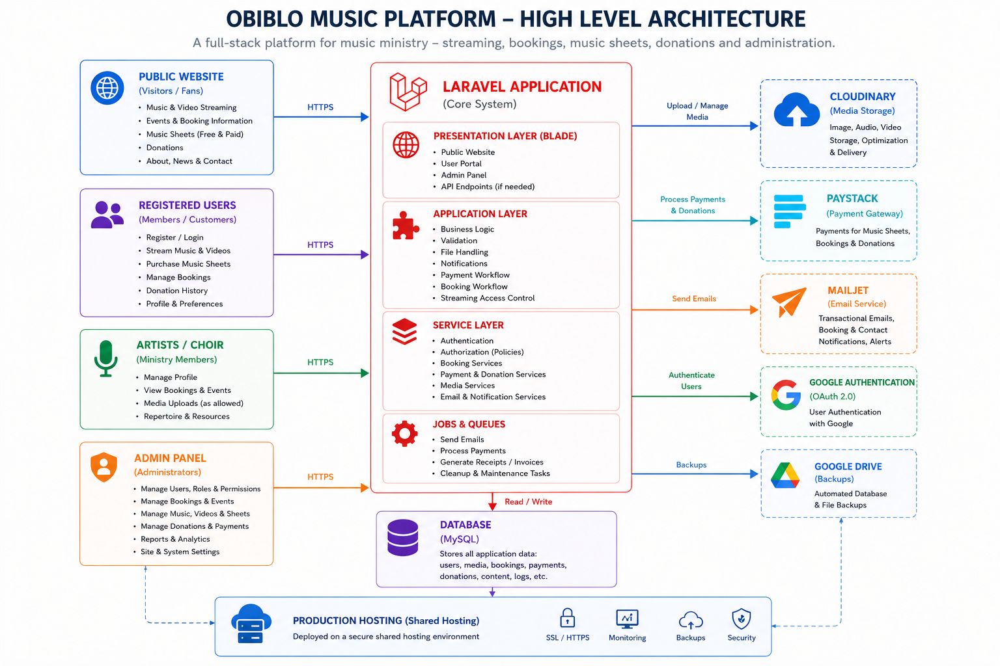
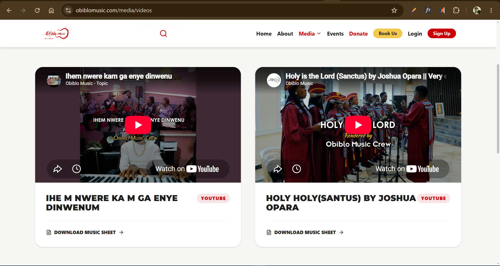
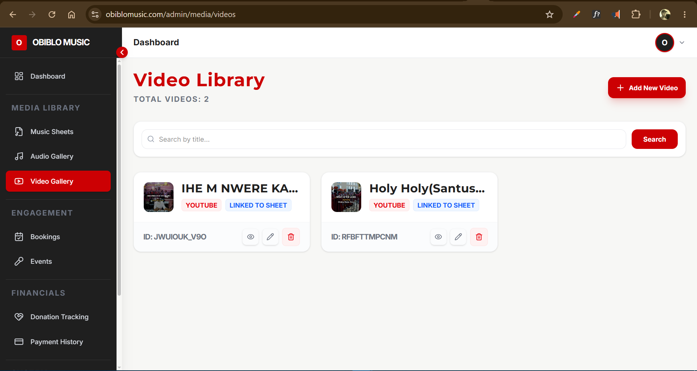
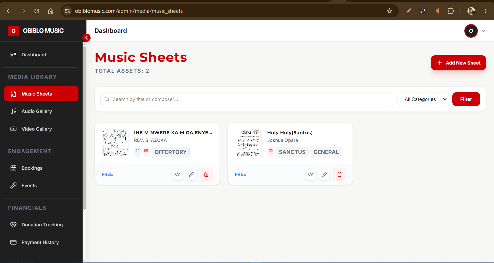
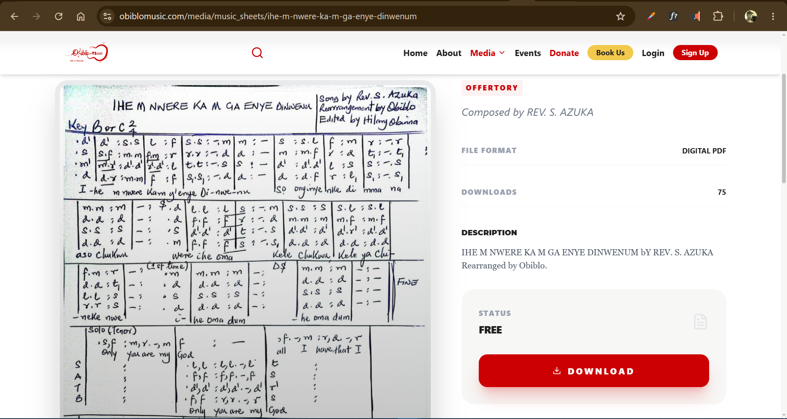
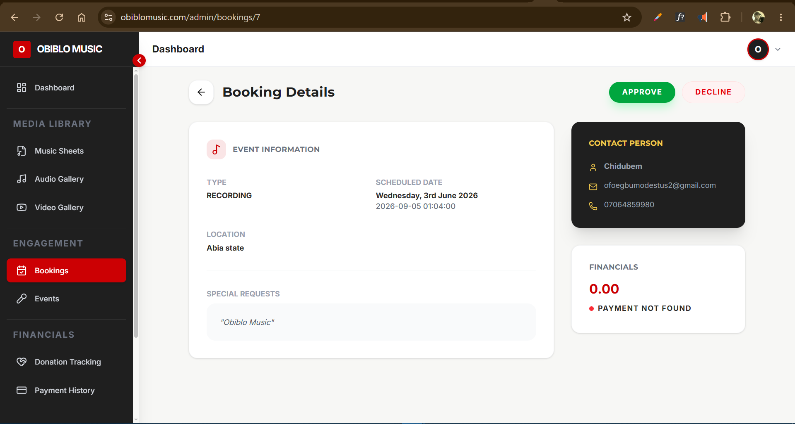
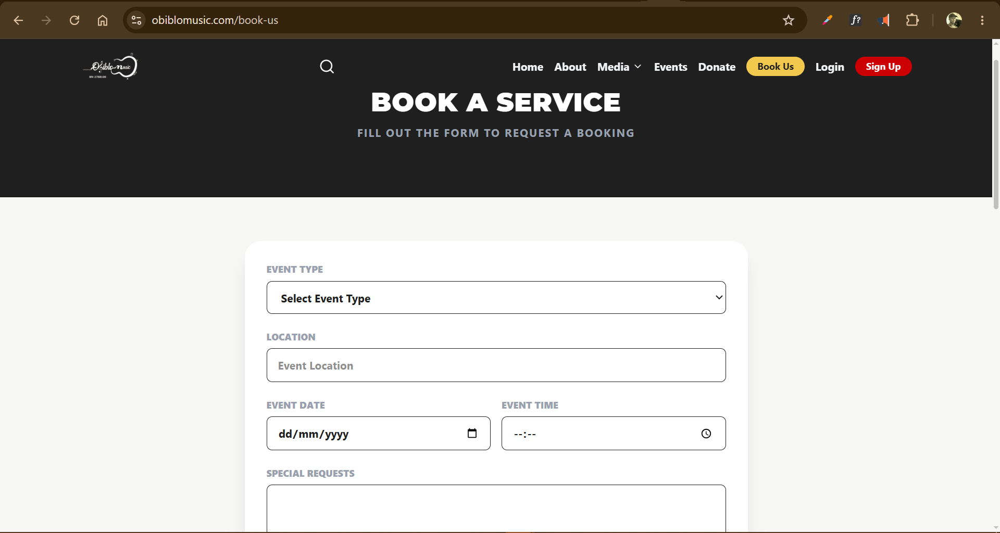
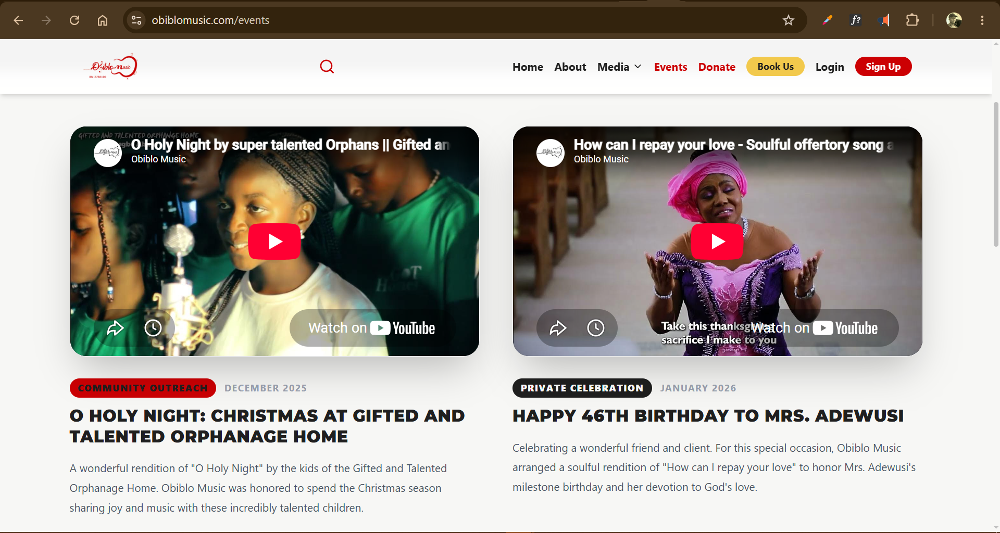
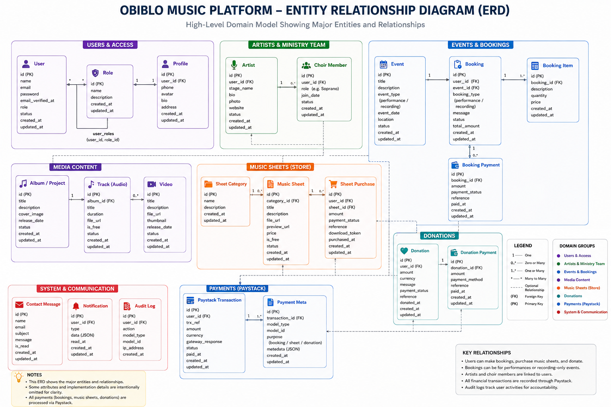
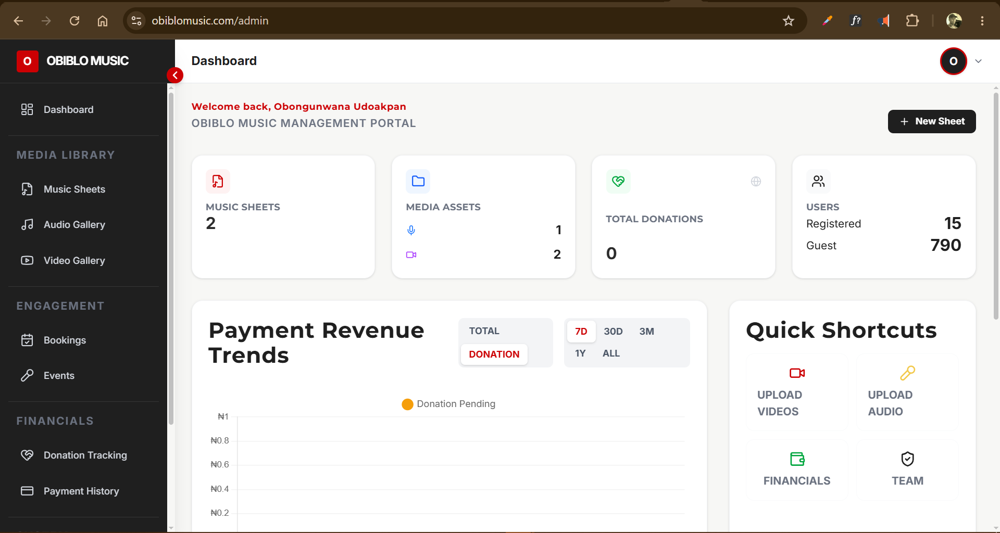

<div align="center">

# Music Production and Management Platform

### A full-stack platform for a gospel music ministry — music and video streaming, event bookings, a choir, donations, paid music sheets, and administrative operations, unified in one system.
**Live :** [Visit the Platform](https://obiblomusic.com/)


</div>

---
> [!NOTE]
> This repository is a public case study of my work on the platform. It does **not** contain the application's proprietary source code, credentials, private user data, or other confidential information belonging to Peterfleming Arts Limited.
---

## Table of Contents

1. [Project Overview](#project-overview)
2. [My Role](#my-role)
3. [Platform Architecture](#platform-architecture)
4. [Core Platform Areas](#core-platform-areas)
5. [Domain Model](#domain-model)
6. [Administrative Panel](#administrative-panel)
7. [Authentication, Authorization & Activity Tracking](#authentication-authorization--activity-tracking)
8. [Application Structure & Service Layer](#application-structure--service-layer)
9. [Background Jobs & Notifications](#background-jobs--notifications)
10. [Automated Console Commands](#automated-console-commands)
11. [Media & File Management](#media--file-management)
12. [Payments & Donations](#payments--donations)
13. [Automated Testing](#automated-testing)
14. [Deployment & CI/CD](#deployment--cicd)
15. [Security Considerations](#security-considerations)
16. [Third-Party Integrations](#third-party-integrations)
17. [Technology Stack](#technology-stack)
18. [Notable Laravel Architecture](#notable-laravel-architecture)
19. [Resource-Oriented Admin Architecture](#resource-oriented-admin-architecture)
20. [Engineering Highlights](#engineering-highlights)
21. [Project Screenshots](#project-screenshots)
22. [Recommended Technical Diagrams](#recommended-technical-diagrams)
23. [What This Project Demonstrates](#what-this-project-demonstrates)
24. [Confidentiality & Portfolio Disclaimer](#confidentiality--portfolio-disclaimer)
25. [Public Repository Safety Checklist](#public-repository-safety-checklist)
26. [Project Information](#project-information)

---

## Project Overview

**Obiblo Music** is a gospel music ministry built around production, recording, and live performance. Their operations span:

| Area | Description |
|---|---|
| Music Production & Recording | In-house production and recording services |
| Gospel Performance | The ministry performs gospel music themselves, including as a choir |
| Event Bookings (Performance) | Bookings to travel and perform/sing at an event |
| Event Bookings (Recording Only) | Bookings to attend and record an event without performing |
| Music & Video Streaming | Catalog of audio and video content shared via the platform |
| Music Sheets | Original compositions, some free and some paid |
| Donations | Online giving from supporters |

The platform centers on **music events** — bookings, releases, and ministry activity — supported by a full administrative back office.

Rather than a simple content site, the application is a **ministry operations platform**: it manages bookings, media, payments, donations, and audience engagement behind a public-facing experience.

---

## My Role

**Role:** Software Engineer / Lead Developer

I was responsible for the design, development, testing, deployment, and ongoing technical management of the platform.

| Category | Responsibilities |
|---|---|
| Architecture & Data | Application architecture, database design, migrations |
| Backend Development | Laravel backend development, service-layer design, request validation |
| Access Control | Authentication, authorization guards, admin role management |
| Feature Development | Booking system, media catalog, music sheet store, event management, donations |
| Payments | Paystack payment gateway integration |
| Communications | Booking and contact notifications, transactional email |
| Infrastructure | Cloud media storage, automated database backups, CI/CD deployment |
| Quality Assurance | Automated feature and unit test suite, CI-gated deployments |
| Operations | Scheduled jobs, sitemap generation, production maintenance |

---

## Platform Architecture

The platform combines a public-facing ministry website with an authenticated administrative back office.

<p align="center">
  
</p>
---

## Core Platform Areas

### 1. Music & Video Library

The platform maintains a media library of the ministry's audio and video work.

- Audio content is linked to external streaming platforms — **Spotify** and **Audiomack** — rather than hosted directly, and can also be streamed on-site via embedded players (iframes)
- Video content is linked similarly to **YouTube**
- Audio and video entries can be associated with music sheets where applicable
<p align="center">
  
  
</p>

---

### 2. Music Sheets

The ministry composes original music sheets, which can be offered for free or sold individually.

- Each music sheet can include composer details and descriptive information
- Music sheets can be linked to an existing audio entry
- Paid music sheets are gated behind the Paystack payment flow

```text
Music Sheet Created
      ↓
Marked Free or Paid
      ↓
Linked to Audio (optional)
      ↓
Published
      ↓
User Requests Access
      ↓
Free? → Immediate Access
Paid? → Paystack Checkout → Access Granted
```
<p align="center">
  
  
</p>

---

### 3. Event Bookings

Users can book the ministry for two distinct kinds of engagements:

| Booking Type | Description |
|---|---|
| **Performance Booking** | The ministry travels to perform/sing at the event |
| **Recording-Only Booking** | The ministry attends solely to record the event, without performing |

Booking submissions are recorded and trigger a notification workflow to the ministry.

<p align="center">
  
  
</p>

---

### 4. Events

The ministry can publish its own events, such as tours, where the public can register — whether the event is free or requires registration to attend.

<p align="center">
  
</p>

---

### 5. Donations

Supporters can give directly to the ministry online through an integrated Paystack donation flow.

```text
Donor
  ↓
Donation Form
  ↓
Paystack Checkout
  ↓
Payment Verified
  ↓
Donation Record
  ↓
Payment Record
```

<p align="center">
  
</p>

---

### 6. Visitor Tracking

The platform tracks anonymous visitors using browser fingerprinting rather than personal or demographic data.

This allows an anonymous visitor — for example, someone who donates or downloads content without creating an account — to later claim their activity record if they choose to register. Actions performed during an anonymous session are associated with the visitor's fingerprint and can be linked to a registered account afterward.

---

## Domain Model

| Domain Group | Models |
|---|---|
| Core | Admin, User, Visitor |
| Media | Audio, Video |
| Ministry Activity | Booking, Event |
| Commerce & Giving | Donation, Payment |

| Model | Purpose |
|---|---|
| **Admin** | Different administrative account types (Super Admin, Regular Admin, Moderator) |
| **Audio** | Music entries linked to Spotify/Audiomack, streamable on-site via embedded players |
| **Video** | Video entries linked to YouTube |
| **Booking** | Requests to book the ministry to perform or to record an event |
| **Event** | Ministry-published events (e.g. tours) with open or registration-based attendance |
| **Donation** | Records of donations made through the platform |
| **Payment** | Tracks payment transactions across donations and paid music sheets |
| **User** | Registered platform users |
| **Visitor** | Anonymous visitors tracked via browser fingerprint, with no demographic data collected |

<p align="center">
  
</p>

---

## Administrative Panel

The administrative panel is the operational core of the platform.

| Section | Purpose |
|---|---|
| **Dashboard** | Summary and overview of the system |
| **Music Sheets** | Create/manage music sheets, set free or paid status and pricing, link to audio |
| **Audio** | Manage audio entries and streaming links |
| **Video** | Manage video entries and streaming links |
| **Bookings** | Manage incoming performance and recording booking requests |
| **Events** | Manage ministry-published events |
| **Donation Tracking** | View and track donations received |
| **Payment History** | Real-time view of payment transactions processed via Paystack |
| **Registered Users** | View users who created accounts on the platform |
| **Guest/Visitor Users** | View anonymous visitor activity (fingerprint-based, no demographic data) |
| **Staff/Admin Management** | Super Admin can add other administrators and assign them a role |

Most resources follow the same CRUD pattern — **Index**, **Create**, **Edit**, and **Show** pages.

<p align="center">
  
</p>

---

## Authentication, Authorization & Activity Tracking

The platform separates normal users from administrative users through distinct authentication guards, consistent with the ministry's earlier institutional projects.

```text
                    Application
                         │
              ┌──────────┴──────────┐
              │                     │
         Web Guard             Admin Guard
              │                     │
        Normal Users          Administrators
```

### Role-Based Authorization

| Role | Access Level |
|---|---|
| **Super Admin** | Full administrative access; can add other administrators and assign their role |
| **Regular Admin** | Broad administrative access to permitted resources |
| **Moderator** | Restricted administrative access |

Authorization policies are used throughout the admin panel, and administrative actions are tracked so that activity within the system can be reviewed.

> **[DIAGRAM PLACEHOLDER — Admin Role & Authorization Matrix]**

---

## Application Structure & Service Layer

The codebase follows a layered structure that keeps controllers thin:

| Layer | Responsibility |
|---|---|
| **Controllers** | Handle HTTP requests and coordinate workflows |
| **Requests** | Handle form validation separately from controllers |
| **Services** | Encapsulate business logic outside of controllers |
| **Middleware** | Custom middleware handled in its own dedicated layer |
| **Policies** | Enforce resource-level authorization |
| **Models** | Represent domain entities and relationships |
| **Migrations** | Version and manage database structure |

---

## Background Jobs & Notifications

| Component | Purpose |
|---|---|
| **Database Backup Listener** | A queued job that backs up the database and uploads it to Google Drive |
| **Booking Notification** | Notifies the ministry when a user submits a booking |
| **Message Notification** | Notifies the ministry when a user sends a message |

```text
Booking / Message Submitted
      ↓
Event Fired
      ↓
Notification Dispatched
      ↓
Ministry Notified
```

```text
Backup Triggered
      ↓
Queued Job
      ↓
Database Export
      ↓
Upload to Google Drive
```

> **[DIAGRAM PLACEHOLDER — Notification & Backup Job Flow]**

---

## Automated Console Commands

| Command | Purpose |
|---|---|
| **Generate Sitemap** | Regenerates the site's sitemap and writes it to the public folder |

The sitemap command runs automatically as part of the CI/CD deployment pipeline whenever a new page or update is deployed, keeping the sitemap current so Google Search Console can index the site accurately.

```text
Deployment Triggered
      ↓
Generate Sitemap Command
      ↓
sitemap.xml Updated in Public Folder
      ↓
Google Search Console Indexing
```

> **[DIAGRAM PLACEHOLDER — Sitemap Generation & Indexing Flow]**

---

## Media & File Management

The platform uses **Cloudinary** for image storage. Audio and video content are not hosted directly — they are linked to **Spotify** and **Audiomack** (audio) and **YouTube** (video), and can be streamed on-site through embedded players.

---

## Payments & Donations

**Paystack** is integrated as the platform's payment gateway, used for:

- Donations
- Paid music sheet purchases

The **Payment** model tracks transactions across both use cases, and the admin panel provides a real-time payment history view.

---

## Automated Testing

A dedicated CI workflow (`test.yaml`) runs the automated test suite before deployment, covering both feature and unit tests.

| Test Type | Coverage |
|---|---|
| Login | Simulated login flows |
| Registration | New user registration |
| Email Verification | Verification flow correctness |
| Forgot Password / Reset | Password reset flow |
| Protected Route Access | Confirms guests cannot access protected routes |

```text
Push / Pull Request
      ↓
test.yaml (CI)
      ↓
Feature & Unit Tests
      ↓
Pass → Proceed to Deployment
Fail → Deployment Blocked
```

> **[DIAGRAM PLACEHOLDER — CI Test Gate Before Deployment]**

---

## Deployment & CI/CD

Deployment follows the same automated shared-hosting pipeline used across the ministry's projects, with an added testing gate beforehand.

The deployment workflow handles:

- Running the automated test suite (`test.yaml`) before deployment proceeds
- Deploying application files via FTP
- Executing deployment commands through SSH
- Installing Composer dependencies
- Running database migrations
- Generating the sitemap

```text
Developer
    │
    ▼
Git Repository
    │
    ▼
GitHub Actions
    │
    ├── test.yaml → Run Test Suite
    │
    ├── FTP Deployment
    │
    └── SSH Commands
          │
          ├── Composer Dependencies
          ├── Database Migrations
          └── Generate Sitemap
                    │
                    ▼
             Shared Hosting
                    │
                    ▼
              Production App
```

> **[DIAGRAM PLACEHOLDER — CI/CD Deployment Pipeline]**

### Deployment Security

Production credentials and SSH authentication details are not stored in the repository. Deployment secrets are supplied through GitHub Actions' secret management.

**No private keys, passwords, API credentials, or production environment variables should appear in this public case-study repository.**

---

## Security Considerations

| Area | Implementation |
|---|---|
| Identity | Authentication, separate authentication guards |
| Access Control | Authorization policies, role-based access control |
| Data Integrity | Form validation via dedicated Request classes |
| Payments | Payment verification through Paystack |
| Visitor Privacy | Fingerprint-based visitor tracking with no demographic data collection |
| Secrets | Environment-based secrets, separation of production credentials from source control |
| Quality Gate | Automated test suite run in CI prior to every deployment |

---

## Third-Party Integrations

| Service / Technology | Purpose |
|---|---|
| Cloudinary | Image storage |
| Spotify / Audiomack | Audio streaming |
| YouTube | Video streaming |
| Paystack | Payment gateway for donations and music sheet purchases |
| Google / Laravel Socialite | Google authentication |
| Google Drive | Periodic automated database backups |
| Mailjet | Transactional email delivery |
| GitHub Actions | CI/CD automation and automated testing |
| Shared Hosting + SSH | Production hosting and server operations |

---

## Technology Stack

<div align="left">


</div>

| Layer | Technologies |
|---|---|
| **Backend** | PHP, Laravel, Eloquent ORM, Laravel Authentication & Authorization, Laravel Policies, Laravel Notifications, Queued Jobs |
| **Frontend** | Server-rendered Laravel views |
| **Database** | Relational database architecture, Laravel migrations |
| **Testing** | Automated feature and unit test suite, CI-gated via `test.yaml` |
| **Infrastructure & DevOps** | Shared hosting, SSH, FTP-based deployment, GitHub Actions, Composer |
| **External Services** | Cloudinary, Paystack, Spotify, Audiomack, YouTube, Google Drive, Mailjet |

---

## Notable Laravel Architecture

| Layer | Responsibility |
|---|---|
| **Models** | Represent domain entities and database relationships |
| **Controllers** | Handle HTTP requests and coordinate application workflows |
| **Requests** | Handle validation separately from controllers |
| **Middleware** | Handled in a dedicated, separate layer |
| **Policies** | Enforce resource-level authorization |
| **Services** | Encapsulate business logic and domain workflows |
| **Listeners / Jobs** | Handle queued background work such as database backups |
| **Notifications** | Handle booking and message alerts |
| **Migrations** | Version and manage database structure |
| **Guards** | Separate normal-user and administrative authentication contexts |

---

## Resource-Oriented Admin Architecture

Administrative resources follow a consistent structure:

```text
Resource
  │
  ├── Index
  ├── Create
  ├── Show
  ├── Edit
  └── Update
```

This approach is applied across Music Sheets, Audio, Video, Bookings, Events, Donations, Payments, Registered Users, Guest/Visitor Users, and Staff/Admin management.

---

## Engineering Highlights

| Highlight | Description |
|---|---|
| **Full-Stack Product Development** | Designed and developed a ministry platform spanning media streaming, bookings, commerce, donations, and administration |
| **External Streaming Integration** | Linked audio and video content to Spotify, Audiomack, and YouTube rather than self-hosting media |
| **Payments Integration** | Implemented Paystack for both donations and paid digital content |
| **Automated Quality Gate** | Introduced a CI-run test suite (`test.yaml`) that must pass before deployment proceeds |
| **Privacy-Conscious Visitor Tracking** | Built fingerprint-based visitor tracking that avoids collecting demographic data while still allowing record claiming |
| **Workflow Automation** | Automated sitemap generation, database backups to Google Drive, and deployment |
| **Production Deployment** | Configured and maintained a production Laravel deployment on shared hosting using CI/CD, FTP, SSH, Composer, and migrations |

---

## Project Screenshots

| # | Recommended Screenshot |
|---|---|
| 1 | Homepage / Public Platform |
| 2 | Music Library |
| 3 | Video Library |
| 4 | Music Sheet Store |
| 5 | Music Sheet Checkout |
| 6 | Booking Form |
| 7 | Event Listing |
| 8 | Event Registration |
| 9 | Donation Page |
| 10 | Admin Dashboard |
| 11 | Music Sheet Management |
| 12 | Audio Management |
| 13 | Video Management |
| 14 | Booking Management |
| 15 | Event Management |
| 16 | Donation Tracking |
| 17 | Payment History |
| 18 | Registered Users |
| 19 | Guest/Visitor Users |
| 20 | Staff/Admin Management |

> **[SCREENSHOT GALLERY PLACEHOLDER — Add a curated collection of the strongest UI screenshots here.]**

---

## Recommended Technical Diagrams

### 1. System Architecture

```text
Users
 ↓
Public Website / Admin Panel
 ↓
Laravel Application
 ↓
Services / Policies / Models
 ↓
Database
 ↓
External Services
```

### 2. Domain / Entity Relationship Diagram

Focus on the major relationships between Admin, User, Visitor, Audio, Video, Booking, Event, Donation, and Payment.

### 3. Booking Lifecycle

```text
Booking Submitted
 ↓
Notification Sent
 ↓
Admin Review
 ↓
Performance or Recording-Only Confirmed
```

### 4. CI/CD Pipeline

```text
Git Push
 ↓
GitHub Actions
 ↓
Run Test Suite (test.yaml)
 ↓
FTP Deployment
 ↓
SSH
 ↓
Composer
 ↓
Migrations
 ↓
Generate Sitemap
 ↓
Production
```

---

## What This Project Demonstrates

| Category | Skills Demonstrated |
|---|---|
| Backend Engineering | Laravel application architecture, PHP backend development, service-layer architecture |
| Data | Relational database design, Eloquent ORM |
| Access Control | Authentication, authorization, Laravel policies, multiple authentication guards, role-based access control |
| Application Structure | Request-based validation, dedicated middleware layer, CRUD resource architecture |
| Quality Assurance | Automated feature and unit testing, CI-gated deployments |
| Payments | Third-party payment gateway integration (Paystack) for commerce and donations |
| Media Strategy | Integrating third-party streaming platforms (Spotify, Audiomack, YouTube) instead of self-hosting media |
| Privacy-Aware Design | Fingerprint-based anonymous visitor tracking without demographic data collection |
| DevOps | CI/CD, automated testing gates, shared-hosting deployment, SSH server operations, GitHub Actions |
| Automation | Scheduled database backups, automated sitemap generation for SEO |

---

## Confidentiality & Portfolio Disclaimer

> **This repository is a portfolio case study and documentation of my work on the Obiblo Music platform.**
>
> The original application and its source code remain private because the software was developed for **Obiblo Music** and may contain proprietary business logic, intellectual property, internal workflows, private information, and other confidential material.
>
> This public repository therefore contains **documentation, selected screenshots, architectural explanations, and project information only**. It does not intentionally expose proprietary source code, production credentials, private user information, environment variables, API keys, SSH keys, passwords, or other confidential infrastructure details.
>
> Screenshots and technical descriptions included here are presented strictly for professional portfolio purposes.

---

## Public Repository Safety Checklist

Before publishing this case study, verify that the repository contains **none** of the following:

| Category | Items to Exclude |
|---|---|
| Credentials & Secrets | `.env` files, API keys, Cloudinary secrets, Paystack keys, Mailjet credentials, SSH private keys, GitHub deployment secrets, database credentials, production passwords, authentication tokens |
| Private Data | Private user records, personal contact information, visitor fingerprint data |
| Infrastructure Details | Private admin URLs where inappropriate, signed URLs containing sensitive information, internal server paths, internal hostnames |
| Proprietary Material | Confidential business documents, proprietary source code |

Also review screenshots carefully for: email addresses, phone numbers, names of private individuals, password fields, API responses, browser URLs, admin credentials, database IDs, internal hostnames, and private documents.

---

## Conclusion

The Obiblo Music platform brings a gospel ministry's production, performance, and outreach activity into a single digital operating system.

It connects:

**Music & Video Library → Music Sheets → Bookings → Events → Donations → Payments → Administration**

The system was designed to streamline bookings, protect visitor privacy, automate SEO and backup housekeeping, and gate every deployment behind an automated test suite.

From an engineering perspective, the project demonstrates the ability to take a real ministry's operational needs — bookings, streaming, commerce, and donations — and translate them into a maintainable, tested, full-stack Laravel application.

---

## Project Information

| Category | Details |
|---|---|
| **Organization** | Obiblo Music |
| **Project Type** | Ministry Operations & Digital Experience Platform |
| **Backend** | Laravel / PHP |
| **Database** | Relational Database |
| **Media Storage** | Cloudinary (images); Spotify, Audiomack & YouTube (streaming) |
| **Payments** | Paystack |
| **Email** | Mailjet |
| **Backups** | Google Drive (automated, queued) |
| **Authentication** | Laravel Authentication / Google Social Login |
| **Testing** | Automated feature & unit test suite (CI-gated) |
| **Deployment** | Shared Hosting |
| **CI/CD** | GitHub Actions |
| **Server Access** | SSH |
| **Deployment Method** | FTP + SSH |
| **Source Code** | Private / Proprietary |

---

<div align="center">

**Built to connect ministry, music, and community through one digital platform.**

</div>
